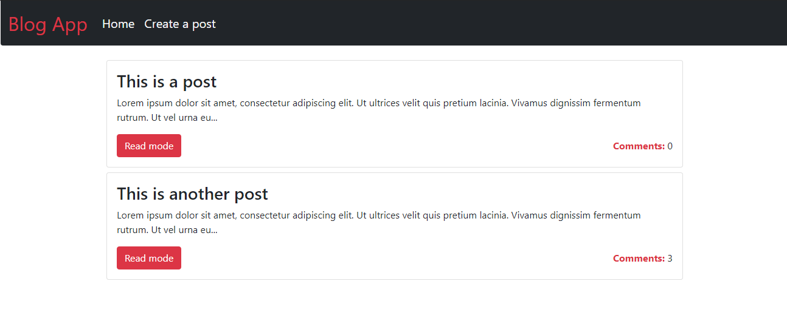
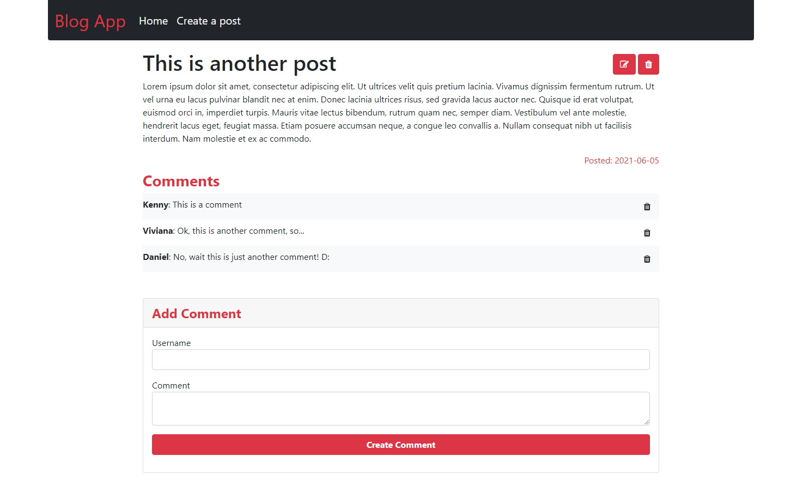
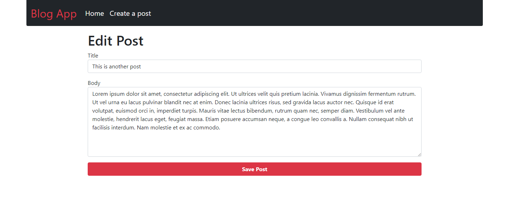

# Blog App

## This Blog is a project developed as part of the Microverse curriculum, to be more specific, is part of the Ruby on Rails module.

#### It consists in a web application to have our own blog. Is really simple, but it works like charm. You can add, edit or delete a post, also you can add or delete a comment.

### Main Page



#### This is the main page, where you take a quick view of the post, with first lines of content and number of comments.

### View post


#### This page shows the entire content of a post, also show the comments and enables the user to create a new comment, also delete a comment. You can also edit or delete the post.

### Edit Post


##### This page allows the user to edit a post.

### Built using
    - Ruby
    - Ruby On Rails
    - Rubocop
    - SQLite3
    - Github
    - Heroku
    - RubyMine
    - CSS3

## Getting Started

To get a local copy up and running follow these simple example steps.

### Prerequisites

* Make sure that **Ruby Environment** is installed in your computer (try to run _ruby_ from your prompt), if not you can install it from [here.](https://www.ruby-lang.org/en/downloads/)

* [Download](https://github.com/kensayo/blogapp/archive/refs/heads/develop.zip) and unzip **or** [clone this repository](https://docs.github.com/es/github/creating-cloning-and-archiving-repositories/cloning-a-repository)


### Setup

- Open your terminal and move to the root of the project, using ```cd``` command.
- Then you must run ```$ rails db:migrate```, so you can work locally with the database.
- You must run ```$ bundle install```  
- Start server using ```$ rails s```

### Usage

- You can go to http://127.0.0.1:3000/ to use the app locally

## 👤 Kenny Ortega

- GitHub: [kensayo](https://github.com/kensayo)
- Twitter: [@kensayo](https://twitter.com/kensayo)
- LinkedIn: [LinkedIn](https://www.linkedin.com/in/kennyortega/)

### Check it online!

[Live Preview](https://kenny-blogapp.herokuapp.com/)

### Contributions and issues are welcome!

License
This project is MIT licensed.
